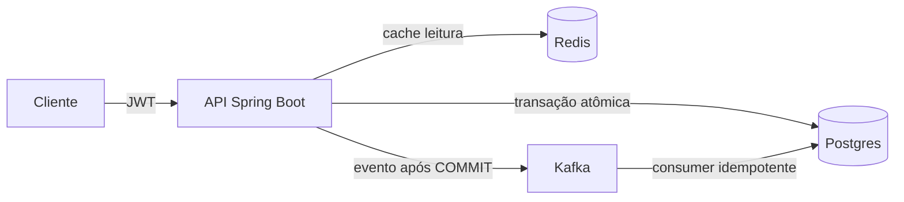

# Pix Ledger API

API de extrato bancário estilo PIX com foco em **corretude sob concorrência** e **observabilidade de negócio**.
Projeto de estudo construído passo a passo: cada mecanismo — lock pessimista, lock otimista com retry, eventos com idempotência, cache de leitura — é validado por testes de integração e medido por teste de carga real.

## Arquitetura



Os quatro pilares:

| Pilar | Mecanismo |
|---|---|
| **Atomicidade** | Transferência = débito + crédito no mesmo `@Transactional`; contas travadas com lock pessimista em ordem de UUID (sem deadlock) |
| **Concorrência** | Lançamentos usam lock otimista (`@Version`) com retry — sob contenção, relê e tenta de novo até 3×, depois 409 |
| **Eventos** | `EntryCreatedEvent` publicado **após o COMMIT** (`@TransactionalEventListener`); consumer grava projeção com **idempotência por PK** |
| **Leitura** | Extrato e conta cacheados no Redis como **records serializáveis** (nunca entidades JPA) |

## Stack

| Camada | Tecnologia |
|---|---|
| Aplicação | Java 26, Spring Boot 4.1.1, Maven (`./mvnw`) |
| Banco | PostgreSQL 16 (Liquibase para schema) |
| Mensageria | Kafka (Confluent 7.7.1, KRaft, eventos em JSON) |
| Cache | Redis 7 |
| Observabilidade | Micrometer + Prometheus + Grafana (dashboard provisionado como código) |
| Testes | JUnit 5, Spring, Testcontainers (Postgres + Kafka reais) |

## Como rodar

**Pré-requisitos:** Docker.

```bash
# tudo: Postgres, Kafka, Redis, kafka-ui, Prometheus, Grafana + a aplicação (Dockerfile multi-stage)
docker compose up -d --build
```

Desenvolvimento (sem container pra aplicação, hot reload da IDE sobre a infra de cima):

```bash
./mvnw spring-boot:run
```

O usuário `admin` / `admin123` é seedado via Liquibase.

| Porta | Serviço |
|---|---|
| 8081 | API |
| 5432 | Postgres |
| 9092 | Kafka (29092 interno) |
| 6379 | Redis |
| 8080 | Kafka UI |
| 9090 | Prometheus |
| 3000 | Grafana (admin/admin) |

## API

| Método | Rota | Descrição |
|---|---|---|
| POST | `/api/v1/auth/login` | Autentica e retorna o JWT |
| POST | `/api/v1/accounts` | Cria conta |
| GET | `/api/v1/accounts/{id}` | Conta (cached) |
| GET | `/api/v1/accounts/{id}/ledger?page=0&size=10` | Extrato paginado (cached) |
| POST | `/api/v1/accounts/{id}/entries` | Lançamento CREDIT/DEBIT (lock otimista) |
| POST | `/api/v1/transfers` | Transferência atômica (lock pessimista) |

```bash
TOKEN=$(curl -s -X POST localhost:8081/api/v1/auth/login \
  -H "Content-Type: application/json" \
  -d '{"name":"admin","password":"admin123"}' | jq -r .accessToken)
AUTH="Authorization: Bearer $TOKEN"

# conta
ID=$(curl -s -X POST localhost:8081/api/v1/accounts -H "$AUTH" \
  -H "Content-Type: application/json" -d '{"ownerName":"Fulano"}' | jq -r .id)

# crédito inicial
curl -s -X POST localhost:8081/api/v1/accounts/$ID/entries -H "$AUTH" \
  -H "Content-Type: application/json" -d '{"entryType":"CREDIT","amount":1000.00}'

# transferência (débito na origem + crédito no destino, mesmo commit)
curl -s -X POST localhost:8081/api/v1/transfers -H "$AUTH" \
  -H "Content-Type: application/json" \
  -d "{\"sourceAccountId\":\"$ID\",\"destinationAccountId\":\"$OUTRO_ID\",\"amount\":10.00}"
```

**Semântica de erros:** `400` (validação), `401` (JWT), `404` (conta), `409` (conflito de concorrência / conta inativa), `422` (saldo insuficiente).

## Concorrência — como foi validada

- **Transferência:** `SELECT ... FOR UPDATE` em ordem de UUID (ordem determinística elimina deadlock). O teste de concorrência roda 2 × 80 transferências paralelas sobre saldo 100: exatamente uma falha `422`, saldo final correto, sem travamento.
- **Lançamento:** lock otimista + retry via auto-referência transacional (`self` com `@Lazy`, para passar pelo proxy). Conflito residual vira `409 Conflict`.
- **Evento:** publicado no `AFTER_COMMIT` — nunca existe evento de transação que não ocorreu. Consumer grava `entry_events` com `entry_id` como PK; duplicado cai no `existsById` e é contado como `ledger.event.duplicated`.

## Observabilidade

Métricas de negócio em `/actuator/prometheus` (histogramas com percentis p95/p99 habilitados):

- `ledger.transfer.duration` / `ledger.entry.duration` — timers **por resultado** (`success`, `insufficient`, `conflict`, `inactive`, `not_found`, `http_*`)
- `ledger.event.consumed{type}` / `ledger.event.duplicated` — saúde da projeção e da idempotência
- `http.server.requests`, `jvm_memory_used`, `kafka_consumer_fetch_manager_records_lag`

O Grafana provisiona (como código, sem clique) o dashboard **Pix Ledger API**: throughput e latência por cenário, distribuição de resultados, eventos consumidos/duplicados, erros 4xx/5xx e lag do Kafka.

## Teste de carga (k6)

Três cenários simultâneos: leitura com cache, lançamento com lock otimista (contenção), transferência com lock pessimista (200/s alvo por par de contas).

```bash
docker run --network host -i grafana/k6 run - < k6/load-test.js
# variações: -e TRANSFERS_TPS=400 -e PAIRS=50 -e DURATION=60s
```

Resultado medido nesta máquina (dev, 30s, 10 pares de contas):

| Cenário | Carga | p95 | Erros |
|---|---|---|---|
| Leituras (cache) | 20 VUs | 4.5 ms | 0% |
| Transferências | 200/s | 6.9 ms | 0% |
| Lançamentos | 100/s | — | 0% (409 esperados sob contenção) |
| **Total** | **~1.012 req/s** | — | **0.03%** (só os 409 esperados) |

O teste de carga já pegou um bug real de produção: `@Cacheable` tentava serializar **entidade JPA** no Redis (`Cannot serialize value of type Account`). Correção: cache passou a guardar records serializáveis com o mesmo contrato JSON.

> Nota: o throughput de transferência é limitado pelo lock pessimista **por par de contas** (fila serializada). Escale `PAIRS` no k6 para subir o teto — é o experimento didático do lock.

## Testes

```bash
./mvnw test
```

28 testes de integração — 13 controller/contas, 7 transferências (incl. concorrência), 3 Kafka (E2E + idempotência + duplicidade), 4 auth, 1 context. Postgres e Kafka reais via Testcontainers, sem mocks de infra.

## Estrutura

```
pix_ledger_api/src/main/java/com/pixledgerapi/
├── controller/   # REST (accounts, transfers, auth)
├── service/      # regra de negócio + locks + cache + métricas
├── event/        # EntryCreatedEvent, publisher (AFTER_COMMIT), consumer idempotente
├── model/        # Account, LedgerEntry, EntryEvent (projeção)
├── repository/   # Spring Data + query de lock pessimista
├── dto/          # records de entrada/saída (AccountResponse, LedgerEntryResponse...)
└── config/       # Security (JWT), Swagger
```